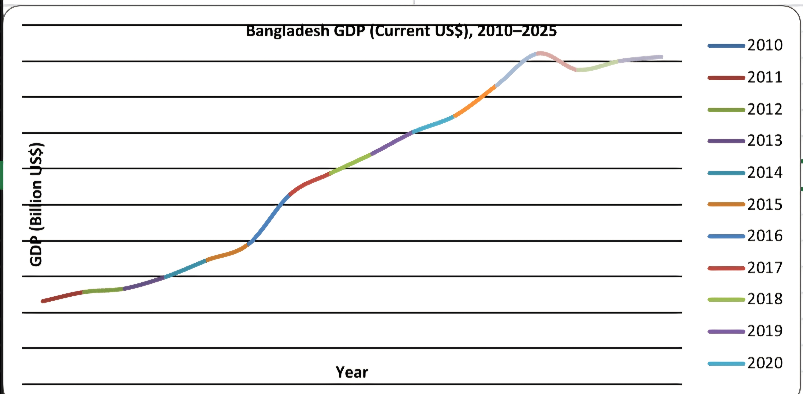
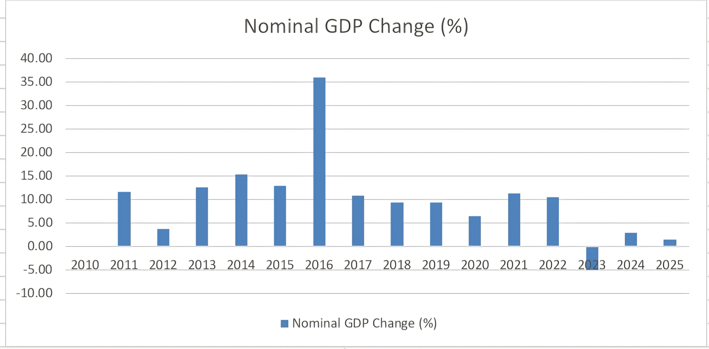

# Bangladesh GDP Analysis

## About the Project

This project analyzes the Gross Domestic Product (GDP) of Bangladesh using World Bank data. The analysis covers the period from 2010 to 2025 and focuses on understanding GDP trends and nominal changes over time.

## Objectives

- Analyze the trend of Bangladesh's GDP.
- Calculate year-on-year nominal GDP changes.
- Measure the total nominal GDP increase.
- Calculate GDP CAGR.
- Create charts to visualize GDP trends.

## Data Source

World Bank — World Development Indicators

## Data Period

2010–2025

## Indicators

- GDP (Current US$)
- GDP in Billion US$
- Nominal GDP Change (%)
- GDP Trend

## Tools Used

- Microsoft Excel
- GitHub
- World Bank Data

## Key Findings

- GDP increased from $115.28 billion in 2010 to $465.32 billion in 2025.
- Total nominal GDP increased by 295.85% between 2010 and 2025.
- The CAGR of nominal GDP was 9.61%.
- The highest year-on-year nominal GDP change was 35.91% in 2016.
- The lowest year-on-year nominal GDP change was -4.94% in 2023.
- The average nominal GDP change during 2011–2025 was 9.93%.

## Visualizations

### Bangladesh GDP Trend (2010–2025)

### Bangladesh Nominal GDP Change (2011–2025)

## Economic Interpretation

Bangladesh's nominal GDP showed an overall upward trend from 2010 to 2025. However, the rate of change varied across years. The largest nominal GDP increase occurred in 2016, while 2023 recorded a negative nominal GDP change.

## Limitations

The GDP figures are measured in current US dollars. Therefore, changes in prices and exchange rates can affect the results. Nominal GDP change should not be interpreted as real GDP growth.

## Future Scope

Further analysis can include:

- Real GDP growth
- GDP per capita
- Inflation
- Exchange rates
- Sector-wise GDP analysis
- Other macroeconomic indicators

## Conclusion

The analysis shows a substantial long-term increase in Bangladesh's nominal GDP between 2010 and 2025. The project demonstrates basic skills in data analysis, Excel calculations, data visualization, and economic interpretation.
